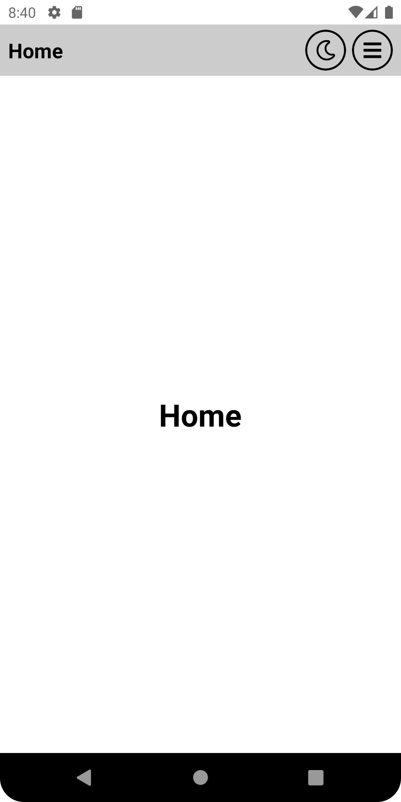
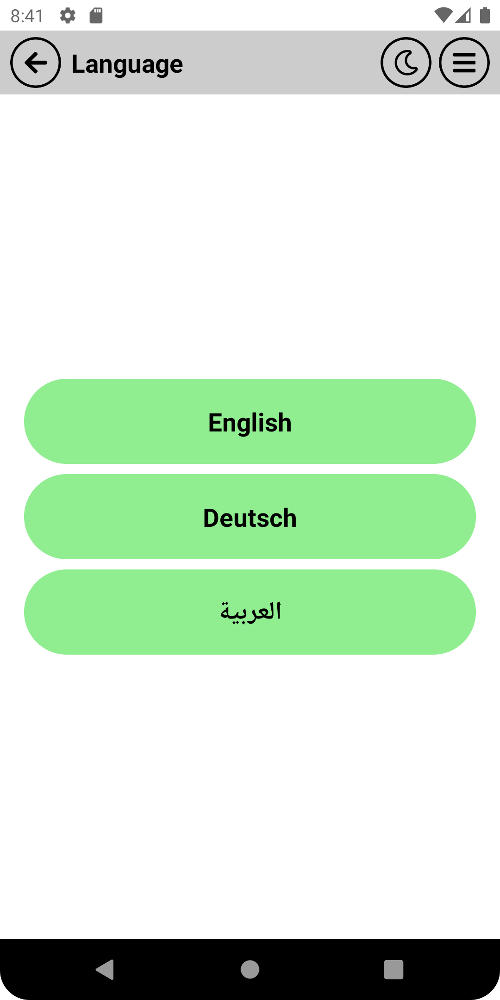
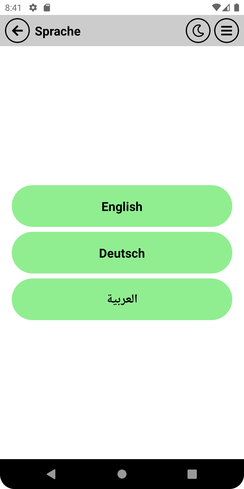
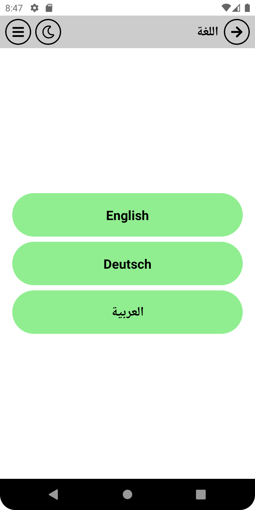

# OmarThinks-React-Native-template

# A) About:

A template pre-configured with requirements for most projects

## Youtube:

https://www.youtube.com/watch?v=VN2tiZ5bv7M

# B) How to use:

- Clone the Repo:

<b>

```bash
git clone https://github.com/OmarThinks/OmarThinks-React-Native-Template
```

</b>

- Open the cli folder (I might create an Expo folder soon)
- Copy the project with the latest version from the cli folder, and paste it
- run this command `npm install`
- run this command `npm start`

# C) Texhnologies Used:

- React
- React Native
- Redux ToolKit
- React Navigation
- Async Storage
- i18next
- NativeWind
- Modle Resolver
- TypeScript
- React Native Paper

# D) Features:

### D-1) Thememing:

This template supports light and dark themes.  
On changing the theme, the theme name is stored presistently using Async Storage, and it initialized in the Splash screen on start.

**Light Theme:**



**Dark Theme:**


### D-2) Localization:

The app supports languages, and also switching rtl or lrt.  
But if the app changes the language, and both languages have differenet directions, then the app must restart.

**English is ltr(Left to Right):**



**German is ltr(Left to Right):**



**Arabic is rtl(Right to Left):**



### D-3) Common Components:

For this application, i created the following common compoennets:

- Text
- TouchFiller
- Icon
- CircleIcon
- AppBar

### D-4) NativeWind:

Just like using TailWindCSS for React projects, NativeWind is the same as TailWindCSS but for React Native.  
The template supports TailWindCSS

### D-5) Mainlayout:

MainLayout is a HOC (Higher-Order Component) that I have created for this template.  
MainLayout reduces code redundency, and keep the code as DRY nd possible.

### D-6) Navigation and Theme Type-Safety:

<b>

```ts
import { useAppTheme } from "@theme";

// Navigation and Route
import { NativeStackNavigationProp } from "@react-navigation/native-stack";
import { RootStackParamList, navigationNames } from "@navigation";
import { RouteProp, useNavigation, useRoute } from "@react-navigation/native";

type SplashScreenProps = RouteProp<
  RootStackParamList,
  typeof navigationNames.Splash
>;

const MyComponent = () => {
  // Theme
  const colors = useAppTheme().colors;
  const theme = useAppTheme();

  // Nav
  const navigation =
    useNavigation<NativeStackNavigationProp<RootStackParamList>>();
  const route = useRoute<SplashScreenProps>();
  const params = useRoute<SplashScreenProps>().params;

  return <></>;
};

export default MyComponent;
```

</b>

# E) Motivation:

- To start projects faster, instead of spending tto much time preconfiguring everything.

# F) Todos:

- Create an Expo template
